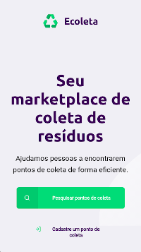

# 
## Criada durante o evento Next Level Week - Trilha Starter, desenvolvido em junho de 2020 pela [Rocketseat](https://rocketseat.com.br/)
 

## ℹ O que é a Next Level Week?

O NLW é uma semana prática com muito código, desafios, networking e um único objetivo: levar o dev para o próximo nível.

É um evento online e totalmente gratuito que ajuda o dev a dar o próximo passo na sua evolução.

## 💻 Projeto

O projeto "Ecoleta" é um projeto desenvolvido baseado na semana internacional do Meio Ambiente. O Objetivo é conectar pessoas a empresas que coletam resíduos específicos, como lâmpadas, baterias, óleo de cozinha, etc.

## 🚀 Tecnologias

Esse projeto foi desenvolvido com as seguintes tecnologias:

- [JavaScript](https://pt.wikipedia.org/wiki/JavaScript)
- [HTML](https://pt.wikipedia.org/wiki/HTML)
- [CSS](https://pt.wikipedia.org/wiki/Cascading_Style_Sheets)
---
- [Nunjucks](https://mozilla.github.io/nunjucks/)
- [Express](https://expressjs.com/pt-br/)
- [SQLite3](https://www.sqlite.org/index.html)

## ℹ Como usar

Para clonar e executar este aplicativo, você precisará do [Git](https://git-scm.com) e [Node.js](https://nodejs.org/pt-br/) instalado em seu computador.

Em sua linha de comando:

```powershell
# Clone este repósitorio
git clone https://github.com/Wendy-Anna/Ecoleta

# Vá para o repósitorio
cd .\Ecoleta\

# Instale as dependências
npm install

# Inicie o site
npm start

# Acesse o site pela linha de comando ou pelo navegador
start "http://localhost:3000"
```

### Instrutor: [Mayk Brito](https://github.com/maykbrito)
---
***</>*** **by [Wendy-Anna Albuquerque Lopes](https://github.com/Wendy-Anna)**
