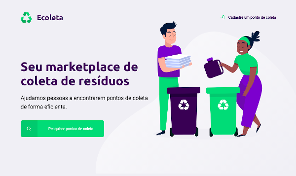

# 
## Criada durante o evento Next Level Week - Trilha Starter, desenvolvido em junho de 2020 pela [Rocketseat](https://rocketseat.com.br/)
 
* **HTML5**
* **CSS3**
* **JavaScript**
* **Node.js**
* **Banco de Dados SQLite**
* **Comandos SQL**

## ℹ Como usar

Para clonar e executar este aplicativo, você precisará do [Git](https://git-scm.com) e [Node.js](https://nodejs.org/pt-br/) instalado em seu computador.

Em sua linha de comando:

```powershell
# Clone este repósitorio
git clone https://github.com/Wendy-Anna/Ecoleta

# Vá para o repósitorio
cd .\Ecoleta\

# Instale as dependências
npm install

# Inicie o site
npm start

# Acesse o site pela linha de comando ou pelo navegador
start "http://localhost:3000"
```

### Instrutor: [Mayk Brito](https://github.com/maykbrito)
---
***</>*** **by [Wendy-Anna Albuquerque Lopes](https://github.com/Wendy-Anna)**
